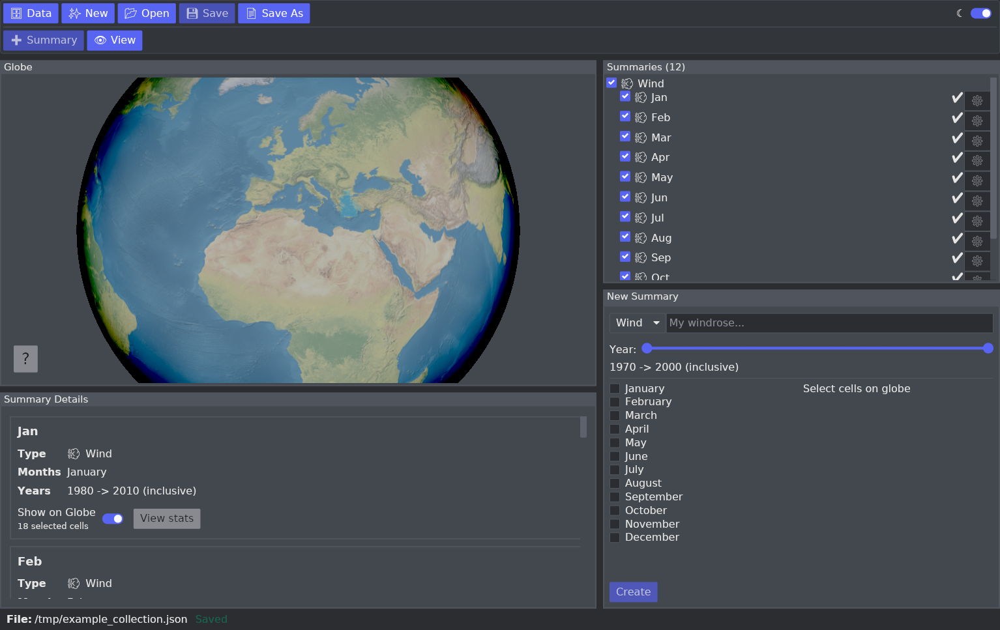
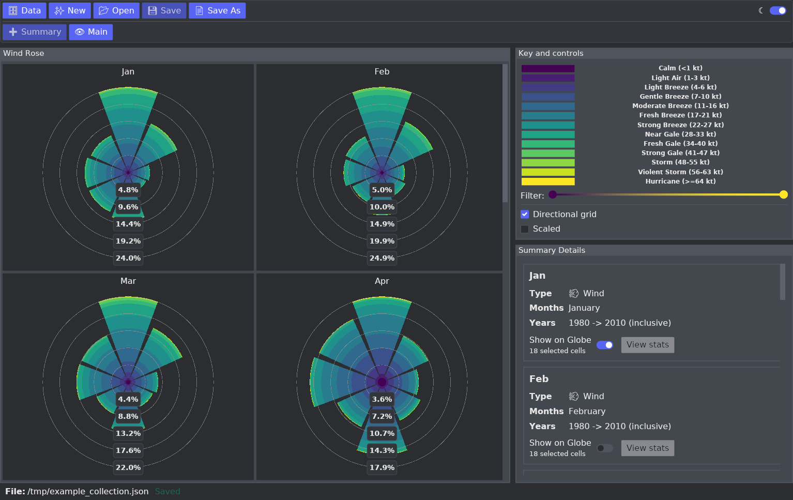
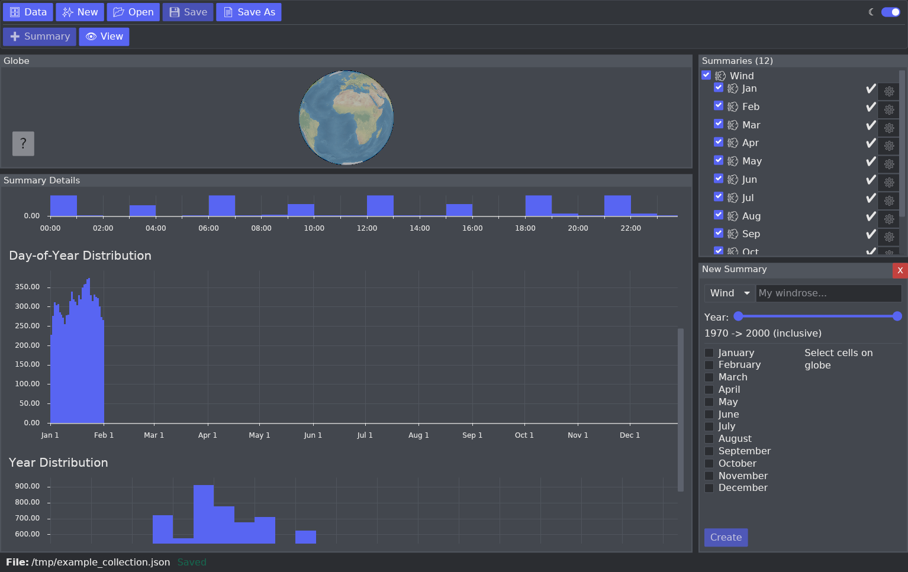
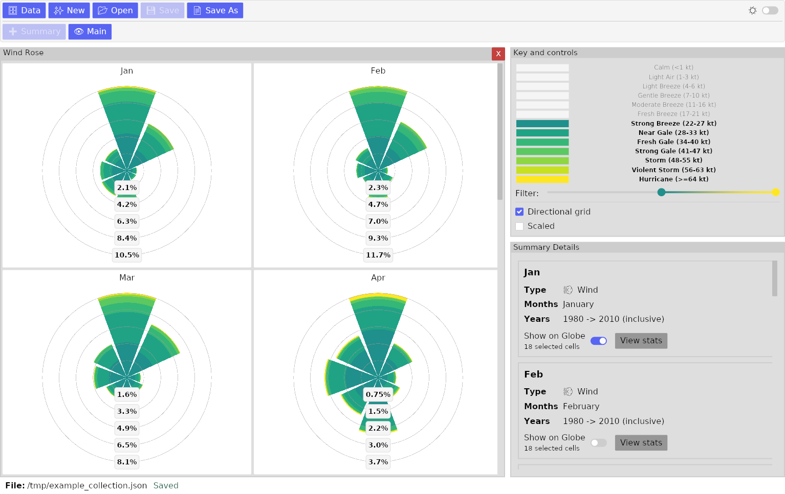

<h1> Historical Marine Weather GUI</h1>

<br />

<p><strong>A GUI for exploring historical marine weather data.</strong></p>

<div align="center">
  
  
  
  
</div>


## ⚠️ Warnings

- This project is for exploratory and reference use only. Do not use it for navigation, safety, or operational decision-making.
- This project is a work in progress. Breaking changes should be expected.
- Raw observation data is used as-is, with no correction for uneven temporal or spatial coverage. Outliers are not removed. Produced summaries may be skewed by dense reporting regions or time periods, or by incorrect observations.

## Features

Import ICOADS data from local files or download for selected year range. 
Build summary collections from the main view by selecting a geographic region together with filters such as year range and month, then inspect the result in the wind rose view.
Wind is the only supported summary type for now. 
The GUI also shows supporting summary statistics, including the number of observations and distributions by day of year, hour of day, and year, which can help reveal uneven coverage in the underlying data.
Collections can be saved and reopened later.

## Usage

### Building from Source

Prerequisites:

- [Rust](https://www.rust-lang.org/tools/install)
- [Git LFS](https://git-lfs.com/)

Clone the repository and run:

```sh
cargo run --release --bin hmw-gui
```

### Release binaries

WIP

## Data

This project uses [ICOADS](https://www.ncei.noaa.gov/products/international-comprehensive-ocean-atmosphere-data-set), the International Comprehensive Ocean-Atmosphere Data Set. ICOADS is a long-running collection of historical surface marine observations distributed by NOAA NCEI.

Helpful links:

- [ICOADS overview](https://www.ncei.noaa.gov/products/international-comprehensive-ocean-atmosphere-data-set)
- [ICOADS data archive](https://www.ncei.noaa.gov/data/international-comprehensive-ocean-atmosphere/v3/archive/)
- [IMMA1 format summary](https://www.ncei.noaa.gov/data/international-comprehensive-ocean-atmosphere/v3/doc/R3.0-imma1_short.pdf)

## Planned work

- GUI
  - [x] Data import
  - [x] Build summary collections with save/load
  - [x] Wind rose
  - [ ] Graphs for single-variable summaries
  - [ ] Alternative to geohash gridding for the globe
  - [ ] Observation geo density display
  - [ ] Themes
  - [ ] More tests

- ICOADS data
  - [x] Wind: direction and speed
  - [ ] Waves and swell: height and period
  - [ ] Visibility
  - [ ] Weather codes
  - [ ] Temperature: dry bulb, wet bulb, dew point, sea surface
  - [ ] Coverage re-weighting
  - [ ] Surface supplementary data and indicators

- [ERA5](https://cds.climate.copernicus.eu/datasets/reanalysis-era5-single-levels?tab=overview) data
  - [ ] Preprocess variables
  - [ ] Integrate into the GUI

## Acknowledgements

- Built with [Rust](https://www.rust-lang.org/) and [Iced](https://github.com/iced-rs/iced).
- Uses [ICOADS](https://www.ncei.noaa.gov/products/international-comprehensive-ocean-atmosphere-data-set) surface marine observations distributed by [NOAA NCEI](https://www.ncei.noaa.gov/).
- Uses map data and/or derivative assets from [Natural Earth](https://www.naturalearthdata.com/).
- This project is independent and is not affiliated with, endorsed by, or maintained by NOAA or NCEI.
- See `THIRD_PARTY_NOTICES.md` for bundled asset notices.
